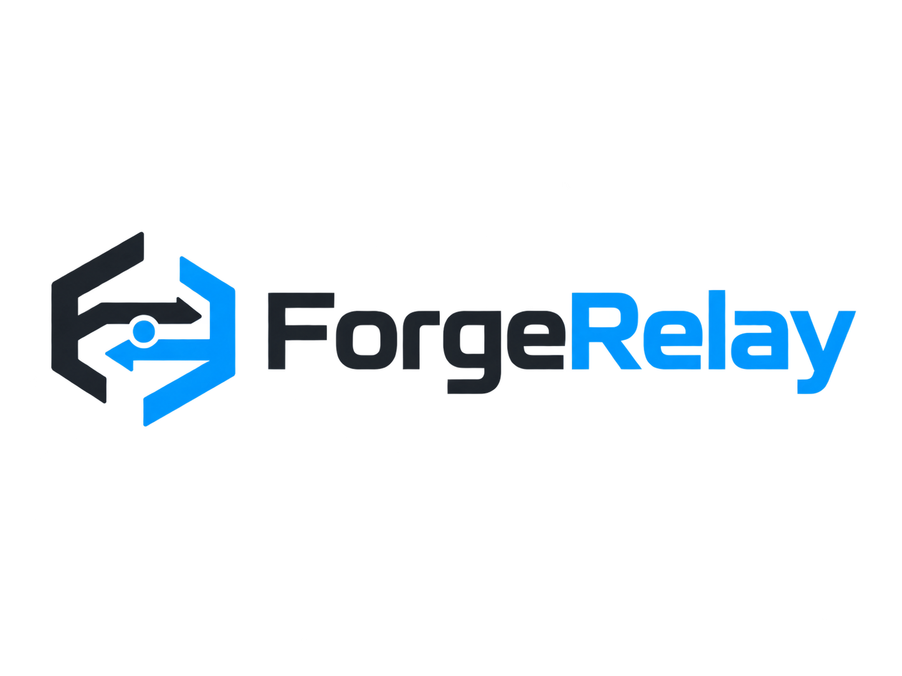
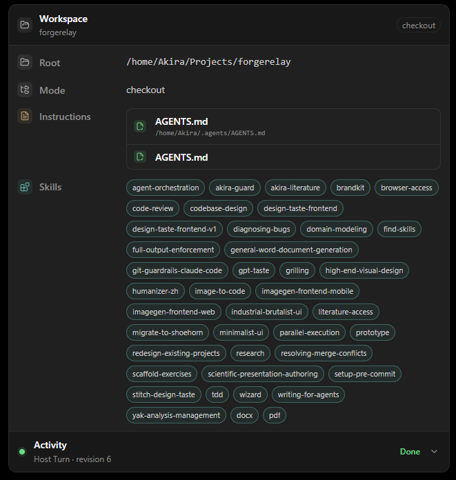

<p align="center">
  <picture>
    <source media="(prefers-color-scheme: dark)" srcset="docs/assets/forgerelay-lockup-dark.png">
    
  </picture>
</p>

<p align="center">
  <strong>Give MCP coding agents a real local workspace.</strong><br>
  <strong>让 MCP 编码 Agent 真正接入你的本地开发环境。</strong>
</p>

<p align="center">
  <a href="#中文">中文</a> · <a href="#english">English</a>
</p>

<p align="center">
  <a href="https://www.npmjs.com/package/@akira-tl/forgerelay"></a>
  <a href="https://github.com/Akira-TL/forgerelay/actions/workflows/release.yml"></a>
  <a href="LICENSE"></a>
</p>

<p align="center">
  
</p>

<p align="center"><sub>ForgeRelay Activity Panel · 实时查看 Workspace 与 Agent 操作</sub></p>

---

# 中文

ForgeRelay 是一个自托管 MCP Server。它让 ChatGPT 和其他支持 MCP 的 Host 直接使用你已经存在的开发环境：项目文件、Shell、Git、语言服务器、本地 Coding Agent，以及另一台机器上的 ForgeRelay。

它不是模型，也不是另一套 Coding Agent UI。Host 负责推理和对话，ForgeRelay 负责把这些决策落到真实环境里执行。项目仍在原来的目录，继续使用你已经安装的编译器、包管理器、Git、SSH、Shell 和本地凭据。

> [!NOTE]
> ForgeRelay 是基于 MIT License 的 [Waishnav/devspace](https://github.com/Waishnav/devspace) 独立衍生项目，不是官方 DevSpace Release。原始版权与 MIT License 保留在 [LICENSE](LICENSE)，来源与修改说明见 [NOTICE.md](NOTICE.md)。

## 主要能力

ForgeRelay 默认直接使用现有 checkout。只有明确需要隔离或并行开发时，才创建 managed worktree。

你可以用它：

- 在允许的项目根目录内读写文件，并运行真实的本地命令；
- 在 Linux / macOS 使用 Bash、zsh 或 POSIX sh，在 Windows 原生使用 PowerShell 7、Windows PowerShell 5.1 或 `cmd.exe`；
- 通过 `code.intelligence` 获取 definition、hover、references、symbols 和 diagnostics；
- 复用持久 Workspace，并用 Workspace Tasks 保存跨 Host Turn / 跨会话的轻量任务状态；
- 在需要隔离时创建 branch-backed managed worktree，并通过安全的 close/finalize 流程集成回目标分支；
- 按需加载 Agent Skills、Capability guides 和本地 Subagent profiles，而不是把所有说明一次塞给 Host；
- 通过 Workspace Relay 使用远端执行环境，或用 Composite Workspace 在一个 Host context 中协调多个独立 Workspace；
- 用 Activity / Audit 记录语义操作和 Bash 输出，用 Lifecycle Hooks 在关键动作前后执行项目规则；
- 诊断和修复部分 managed-worktree 状态，创建持久 checkpoint，并在显式授权下清理历史数据。

## 快速开始

要求：Node.js `>=22.19 <27`、npm、Git，以及一个受支持的 Command Shell Runtime。

全局安装：

```bash
npm install -g @akira-tl/forgerelay
```

初始化并启动：

```bash
forgerelay init
forgerelay serve
```

也可以直接使用 `npx`：

```bash
npx @akira-tl/forgerelay init
npx @akira-tl/forgerelay serve
```

默认本地 MCP endpoint：

```text
http://127.0.0.1:7676/mcp
```

检查实际生效的运行配置：

```bash
forgerelay doctor
```

## 从公网 Host 连接

如果 MCP Host 不能访问你的 localhost，需要给 ForgeRelay 一个可达的 HTTPS 入口。Cloudflare Tunnel、ngrok、Pinggy、Tailscale Funnel 或普通反向代理都可以。

`forgerelay init` 会把两种常见场景分开处理：Direct LAN 绑定 `0.0.0.0`；HTTPS reverse proxy / tunnel 绑定 `127.0.0.1`，只信任 loopback proxy。

例如公开入口是：

```text
https://example.com/forgerelay/main
```

Host 连接：

```text
https://example.com/forgerelay/main/mcp
```

ForgeRelay 使用 Owner-password OAuth approval。新安装默认写入：

```text
~/.forgerelay/config.json
~/.forgerelay/auth.json
```

`auth.json` 和 Owner password 都应保持私密。

## MCP 接口

ForgeRelay 长期保持九个 Core tools：

```text
open_workspace
close_workspace
read
write
edit
rename
delete
bash
capability
```

Code Intelligence、Hooks 检查、Workspace Tasks、Checkpoint、Recovery、Subagent Session 等低频能力通过 `capability` 暴露。这样新增功能不会不断扩大 Host 的顶层 tool schema。

`open_workspace(context="auto")` 只补充发生变化的项目上下文，例如 AGENTS / CLAUDE instructions、Skills、Capability guides、profiles 或 diagnostics。没有变化时，不会重复发送整份 bootstrap。

## Skills

ForgeRelay 负责发现 Skill，不替 Agent 做任务匹配，也不会自动注入 Skill 正文。

Agent 在 `open_workspace` 返回的信息里看到 Skill 的 `name` 和 `description`。如果当前任务匹配，再读取：

```text
read("skills://<name>")
```

入口读取成功后，该 Skill 被视为已加载，内部资源才可以继续读取。

旧的 `disable-model-invocation` frontmatter 不再隐藏 Skill。只要 ForgeRelay 发现了它，Agent 就能看到基本 metadata，再自行决定是否加载。

## LSP Code Intelligence

`code.intelligence` 支持：

- definition 与 hover / type information；
- references；
- document / workspace symbols；
- diagnostics。

ForgeRelay 可以使用系统或项目已经配置好的 Language Server。TypeScript / JavaScript 和 Pyright 也可以在 `forgerelay init` 中由用户显式授权，安装到 ForgeRelay 私有配置目录；安装完成后不需要重启服务。

ForgeRelay 不会未经授权安装 Language Server。`rust-analyzer`、`gopls`、`clangd` 仍由系统或项目工具链提供。

详见 [Configuration Reference](docs/configuration.md#lsp-code-intelligence)。

## Managed worktree

需要隔离或并行开发时，ForgeRelay 可以创建带 `forgerelay/*` 分支的 managed worktree，而不是 detached HEAD。

关闭 active managed-worktree Workspace 时，它会先确认 source checkout 仍然 clean 且位于预期 target branch，然后提交 worktree 剩余修改。只有目标分支可以安全 fast-forward 时，ForgeRelay 才会推进目标分支并删除已经合并的 worktree / managed branch。

如果历史已经分叉，close 会拒绝继续，worktree 保留。ForgeRelay 不会把 source checkout 推进 merge conflict。

Git ignored 的本地文件由用户或 Agent 在需要时显式复制。ForgeRelay 不额外维护 ignored-file provisioning 机制。

## Relay 与 Composite Workspace

Workspace Relay 把操作路由到另一个 ForgeRelay 实例。真正执行命令的 Execution ForgeRelay 继续拥有那边的文件、Git、Shell、Process、Skills、Hooks、LSP、Activity 和 Audit 状态。

Composite Workspace 则把多个 Workspace 放到同一个 Host context 中：

```text
open_workspace({ kind: "composite", name: "research-project" })
```

成员操作始终显式写 member：

```text
read({ workspaceId: "cws_...", member: "code", path: "src/model.py" })
bash({ workspaceId: "cws_...", member: "compute", command: "python train.py" })
```

Composite 不合并成员文件系统，也不会根据 tool type 或 purpose 自动猜 member。

## Lifecycle Hooks

推荐一个 Hook 一个 JSON 文件：

```text
~/.forgerelay/hooks/<hook-name>.json
<repo>/.forgerelay/hooks/<hook-name>.json
```

下面这个例子会在稳定版本 tag push 前执行本地 release gate：

```json
{
  "event": "BeforeTool",
  "matcher": {
    "tool": "bash",
    "commandRegex": "git\\s+push\\s+origin\\s+v\\d+\\.\\d+\\.\\d+"
  },
  "command": "node scripts/release-proof.mjs check-hook",
  "timeoutSeconds": 30,
  "report": true
}
```

只检查 Hook 配置，不执行规则：

```bash
forgerelay hooks list
forgerelay hooks check
forgerelay hooks list --project /path/to/project
```

详见 [Configuration Reference](docs/configuration.md#lifecycle-hooks)。

## 本地 Subagent

ForgeRelay 可以调用用户已经安装并配置好的本地 Coding Agent Runtime。当前 adapter 支持 Codex、Claude、OpenCode、Pi、Cursor 和 Copilot；ForgeRelay 不安装、不捆绑这些执行器。

Profiles 放在：

```text
~/.forgerelay/agents/*.md
.forgerelay/agents/*.md
```

CLI：

```bash
forgerelay agents ls
forgerelay agents run <profile-or-provider-or-id> "<prompt>"
forgerelay agents show <id>
```

MCP Host 通过 `subagent.session` Capability 调用同一套能力。

## 安全边界

ForgeRelay 操作的是真实本机环境。

文件工具受 Workspace 和 allowed roots 约束；Shell 命令则使用启动 ForgeRelay 的本地用户权限执行。ForgeRelay 不给 Shell 再套一层 OS sandbox。

默认情况下，ForgeRelay 会拒绝 elevated / administrator 启动。用户显式选择高权限运行时才允许继续，并会提示 AI 操作可能造成系统级、不可逆的修改。

只连接你信任的 MCP Host，只开放确实需要访问的项目根目录，并保护好 Owner password。

详见 [Security Model](docs/security.md)。

## 平台支持

| 平台 | 状态 | Command Shell Runtime |
| --- | --- | --- |
| Linux | 支持 | Bash 为主要 POSIX compatibility target；可显式选择 zsh / POSIX sh |
| macOS | 支持 | Bash 为主要 POSIX compatibility target；可显式选择 zsh / POSIX sh |
| Windows + PowerShell 7 | 支持 | 原生 `pwsh`，Agent / Hook / pipe / PTY 使用统一 runtime |
| Windows + Windows PowerShell 5.1 | 支持 | 原生 `powershell.exe`，带 5.1-specific guidance |
| Windows + `cmd.exe` | 支持 | 原生 cmd / ConPTY / `.cmd` launcher |
| Windows + Git Bash / WSL / MSYS2 / Cygwin | 兼容路径 | 使用对应 Bash command language |

稳定版本发布前会经过 Linux、macOS 和 Windows 云端验证。

## ForgeRelay 不负责什么

ForgeRelay 不打算变成完整 Agent 平台。模型推理、对话、planning、web、multimodal 和 model selection 仍属于 Host。

项目也不计划增加自己的长期记忆系统、plugin marketplace、第二套 conversation/session runtime 或 OS 级 Shell sandbox。对于本地环境 provisioning，ForgeRelay 只做产品本身需要的部分，不追求“什么都自动化”。

## 文档

- [GitHub Wiki](https://github.com/Akira-TL/forgerelay/wiki)
- [Setup Guide](docs/setup.md)
- [Configuration Reference](docs/configuration.md)
- [ChatGPT Coding Workflow](docs/chatgpt-coding-workflow.md)
- [Local Debugging and 7677 Acceptance](docs/debugging.md)
- [Agent Profile Schema](docs/agents/profile-schema.md)
- [Security Model](docs/security.md)
- [Troubleshooting](docs/gotchas.md)
- [Roadmap](docs/roadmap.md)
- [Changelog](CHANGELOG.md)
- [Attribution Notice](NOTICE.md)

## 本地开发

```bash
npm install --include=dev
npm run dev
npm run debug:accept
npm run typecheck
npm test
npm run build
```

`npm run dev` 使用 7677 debug runtime，不占用正常产品端口 7676。开发验收也应使用 7677 / 7678，不要修改正常安装实例。

---

# English

ForgeRelay is a self-hosted MCP server for coding hosts such as ChatGPT. It gives the Host controlled access to the development environment you already use: project files, shells, Git, language servers, local coding agents, and ForgeRelay instances on other machines.

ForgeRelay is not a model and it is not another coding-agent UI. The Host does the reasoning and conversation; ForgeRelay carries those decisions into the real environment. Repositories stay where they are and continue using your existing compilers, package managers, Git installation, SSH setup, shells, and local credentials.

> [!NOTE]
> ForgeRelay is an independently maintained derivative of the MIT-licensed [Waishnav/devspace](https://github.com/Waishnav/devspace) project. It is not an official DevSpace release. The original copyright and MIT License are preserved in [LICENSE](LICENSE); provenance and modification details are documented in [NOTICE.md](NOTICE.md).

## What it provides

Normal work happens in the existing checkout. ForgeRelay creates a managed worktree only when isolation or parallel development is explicitly requested.

You can use it to:

- read and change files inside configured roots, then run real local commands;
- use Bash, zsh, or POSIX sh on Linux/macOS and native PowerShell 7, Windows PowerShell 5.1, or `cmd.exe` on Windows;
- query definition, hover, references, symbols, and diagnostics through `code.intelligence`;
- reuse persistent Workspaces and keep lightweight cross-turn work in Workspace Task Lists;
- create branch-backed managed worktrees and finalize them back into the target branch through a guarded close lifecycle;
- discover Skills, Capability guides, and local Subagent profiles without injecting every manual into the Host up front;
- route work to another ForgeRelay instance with Workspace Relay, or coordinate several independent Workspaces through a Composite Workspace;
- keep durable Activity / Audit records and run Lifecycle Hooks around selected operations;
- diagnose and repair supported managed-worktree states, create persistent checkpoints, and prune eligible history only with explicit authorization.

## Quick start

Requirements: Node.js `>=22.19 <27`, npm, Git, and a supported Command Shell Runtime.

Install globally:

```bash
npm install -g @akira-tl/forgerelay
```

Initialize and start:

```bash
forgerelay init
forgerelay serve
```

Or use `npx` directly:

```bash
npx @akira-tl/forgerelay init
npx @akira-tl/forgerelay serve
```

Default local MCP endpoint:

```text
http://127.0.0.1:7676/mcp
```

Inspect the resolved runtime configuration:

```bash
forgerelay doctor
```

## Connecting from a public Host

If the MCP Host cannot reach localhost, give ForgeRelay a reachable HTTPS endpoint. Cloudflare Tunnel, ngrok, Pinggy, Tailscale Funnel, or a conventional reverse proxy all work.

`forgerelay init` treats the common cases separately. Direct LAN mode binds to `0.0.0.0`; HTTPS reverse proxy / tunnel mode binds to `127.0.0.1` and trusts only loopback proxies.

For this public base URL:

```text
https://example.com/forgerelay/main
```

the Host connects to:

```text
https://example.com/forgerelay/main/mcp
```

ForgeRelay uses an Owner-password OAuth approval flow. New installations write configuration to:

```text
~/.forgerelay/config.json
~/.forgerelay/auth.json
```

Keep both `auth.json` and the Owner password private.

## MCP interface

ForgeRelay keeps nine long-term Core tools:

```text
open_workspace
close_workspace
read
write
edit
rename
delete
bash
capability
```

Code Intelligence, Hook inspection, Workspace Tasks, checkpoints, recovery, and Subagent Sessions are low-frequency capabilities exposed through `capability`. Adding one of these features does not require another permanent top-level MCP tool.

`open_workspace(context="auto")` sends only project context that changed, such as AGENTS / CLAUDE instructions, Skills, Capability guides, profiles, or diagnostics. Unchanged bootstrap content is not resent on every call.

## Skills

ForgeRelay discovers Skills. The Agent still decides whether a Skill matches the task, and ForgeRelay does not inject the Skill body automatically.

`open_workspace` advertises each discovered Skill with its `name` and `description`. To load one, the Agent reads:

```text
read("skills://<name>")
```

After the entry file loads successfully, nested resources for that Skill become readable.

Legacy `disable-model-invocation` frontmatter no longer hides a discovered Skill. If ForgeRelay discovers it, the Agent can see the basic metadata and decide whether to load it.

## LSP Code Intelligence

`code.intelligence` supports:

- definition and hover / type information;
- references;
- document / workspace symbols;
- diagnostics.

ForgeRelay can use Language Servers already installed or configured by the system or project. TypeScript / JavaScript and Pyright can also be installed into ForgeRelay's private config directory after explicit authorization during `forgerelay init`; they become available without restarting the server.

ForgeRelay never installs a Language Server without that authorization. `rust-analyzer`, `gopls`, and `clangd` remain external system/toolchain dependencies.

See [Configuration Reference](docs/configuration.md#lsp-code-intelligence).

## Managed worktrees

When isolation or parallel development is requested, ForgeRelay can create a managed worktree on a `forgerelay/*` branch instead of using a detached HEAD.

Closing an active managed-worktree Workspace first verifies that the source checkout is clean and still on the expected target branch. ForgeRelay then commits remaining worktree changes. It advances the target branch only when a clean fast-forward is possible, then removes the merged worktree and managed branch.

If the histories diverge, close stops and preserves the worktree. ForgeRelay does not push the source checkout into a merge conflict.

Git-ignored local files can be copied explicitly by the user or Agent when needed. ForgeRelay does not maintain a separate ignored-file provisioning mechanism.

## Relay and Composite Workspaces

Workspace Relay routes operations to another ForgeRelay instance. The Execution ForgeRelay still owns the files, Git state, shell runtime, processes, Skills, Hooks, LSP services, Activity, and Audit data on that machine.

A Composite Workspace places several Workspaces in one Host context:

```text
open_workspace({ kind: "composite", name: "research-project" })
```

Member operations always name the member:

```text
read({ workspaceId: "cws_...", member: "code", path: "src/model.py" })
bash({ workspaceId: "cws_...", member: "compute", command: "python train.py" })
```

Composite Workspaces do not merge member filesystems and do not infer a member from the tool type or purpose text.

## Lifecycle Hooks

Use one JSON file per Hook:

```text
~/.forgerelay/hooks/<hook-name>.json
<repo>/.forgerelay/hooks/<hook-name>.json
```

This example runs a local release gate before a stable version tag is pushed:

```json
{
  "event": "BeforeTool",
  "matcher": {
    "tool": "bash",
    "commandRegex": "git\\s+push\\s+origin\\s+v\\d+\\.\\d+\\.\\d+"
  },
  "command": "node scripts/release-proof.mjs check-hook",
  "timeoutSeconds": 30,
  "report": true
}
```

Inspect Hook configuration without running it:

```bash
forgerelay hooks list
forgerelay hooks check
forgerelay hooks list --project /path/to/project
```

See [Configuration Reference](docs/configuration.md#lifecycle-hooks).

## Local Subagents

ForgeRelay can call local coding runtimes that the user has already installed and configured. The current adapter layer supports Codex, Claude, OpenCode, Pi, Cursor, and Copilot. ForgeRelay does not install or bundle those executors.

Profiles live in:

```text
~/.forgerelay/agents/*.md
.forgerelay/agents/*.md
```

CLI:

```bash
forgerelay agents ls
forgerelay agents run <profile-or-provider-or-id> "<prompt>"
forgerelay agents show <id>
```

MCP Hosts use the `subagent.session` Capability for the same delegation path.

## Security boundary

ForgeRelay operates on the real local machine.

Filesystem tools are constrained by Workspace and allowed-root boundaries. Shell commands run with the authority of the local user that started ForgeRelay; ForgeRelay does not add an operating-system sandbox around them.

Elevated / administrator startup is rejected by default. If the user explicitly opts into elevated execution, ForgeRelay warns that AI-driven changes can become irreversible at system scope.

Connect only MCP Hosts you trust, expose only the project roots you want an Agent to reach, and keep the Owner password private.

See [Security Model](docs/security.md).

## Platform support

| Platform | Status | Command Shell Runtime |
| --- | --- | --- |
| Linux | Supported | Bash is the primary POSIX compatibility target; zsh / POSIX sh can be selected explicitly |
| macOS | Supported | Bash is the primary POSIX compatibility target; zsh / POSIX sh can be selected explicitly |
| Windows + PowerShell 7 | Supported | Native `pwsh` across Agent commands, Hooks, pipe, and PTY execution |
| Windows + Windows PowerShell 5.1 | Supported | Native `powershell.exe` with 5.1-specific command guidance |
| Windows + `cmd.exe` | Supported | Native cmd / ConPTY / packaged `.cmd` launcher |
| Windows + Git Bash / WSL / MSYS2 / Cygwin | Compatibility path | Uses the corresponding Bash command language |

Stable releases are verified in Linux, macOS, and Windows cloud jobs before publication.

## What ForgeRelay does not own

ForgeRelay is not intended to become a complete Agent platform. Model reasoning, conversation, planning, web access, multimodal tools, and model selection belong to the Host.

The project also does not plan to add its own long-term memory system, plugin marketplace, second conversation/session runtime, or ForgeRelay-provided OS shell sandbox. Local environment provisioning stays limited to what the product actually needs rather than expanding automation for its own sake.

## Documentation

- [GitHub Wiki](https://github.com/Akira-TL/forgerelay/wiki)
- [Setup Guide](docs/setup.md)
- [Configuration Reference](docs/configuration.md)
- [ChatGPT Coding Workflow](docs/chatgpt-coding-workflow.md)
- [Local Debugging and 7677 Acceptance](docs/debugging.md)
- [Agent Profile Schema](docs/agents/profile-schema.md)
- [Security Model](docs/security.md)
- [Troubleshooting](docs/gotchas.md)
- [Roadmap](docs/roadmap.md)
- [Changelog](CHANGELOG.md)
- [Attribution Notice](NOTICE.md)

## Local development

```bash
npm install --include=dev
npm run dev
npm run debug:accept
npm run typecheck
npm test
npm run build
```

`npm run dev` uses the 7677 debug runtime and leaves the normal product port 7676 untouched. Development acceptance should use 7677 / 7678 and must not modify the normal installed instance.
